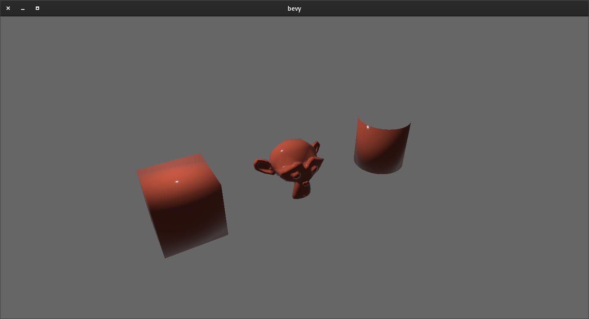

# bevy_blender

[](https://crates.io/crates/bevy_blender/) 

bevy_blender is a [Bevy](https://bevyengine.org) library that allows you to use assets created in [Blender](https://blender.org) directly from the .blend file.

**This project is in maintenance mode for the time being. It is in a place that I am happy with, and it does all that I currently need it to do. I will address issues with easy fixes, and I will manage PRs if anybody wants to add more features (or make fixes). It has been fun though, and I will probably come back to it in the future.**

### Purpose
1) I am learning Rust, and it seemed like a not-too-easy and not-too-hard problem.
1) I would like to be able to maintain several assets in the same .blend file and not have to worry about exporting them.
1) It seems like a good way to contribute to the Bevy project.

### Related Works
1) [Arsenal](https://github.com/katharostech/arsenal) is a project with the goal of using Blender as a UI for creating Bevy games.
1) Reddit/Github user sdfgeoff created the [Blender Bevy Toolkit](https://www.reddit.com/r/rust_gamedev/comments/mr60x4/my_workflow_for_3d_assets_and_custom_components/) which exports Blender objects to Bevy readable scene files (as well as some other cool things).

Both of these projects are neat, but do not serve my desired use case. They both act as extensions of the Bevy game engine, using Blender almost as a front-end framework. I simply want to create assets in Blender and have a ridiculously easy way to access those assets in Bevy with a minimal amount of middle work.

### Credit where credit is due
1) This project was heavily modeled after the [bevy_stl](https://github.com/nilclass/bevy_stl) project, so thanks nilclass!
1) Much of the heavy lifting is accomplished using the [Blend crate](https://github.com/lukebitts/blend), thanks lukebitts!

### Usage
1) Add `bevy_blender` to your `Cargo.toml` dependencies.
1) Add `bevy_blender::BlenderPlugin` plugin to the bevy `App`
1) Load Blender assets (see examples)

### Supported Assets
* Meshes (using `AssetServer`)
* Basic. not node-based, materials (using `AssetServer`)
* Objects (using `BlenderObjectBundle`)

*If the asset name in Blender starts with an underscore, it will not be loaded. You can use this to have extra assets in the .blend file that you do not want loaded to the AssetServer.*

#### Example
```rust
fn main() {
    App::build()
        .add_plugin(bevy_blender::BlenderPlugin)
        .add_startup_system(setup.system())
        // ...
        .run();
}

fn setup(commands: &mut Commands, asset_server: Res<AssetServer>) {
    
    // Spawn the Suzanne Blender object with children and its Blender transform
    spawn_blender_object(&mut commands, &asset_server, "demo.blend", "Suzanne", true, None);

    // Spawn the Suzanne mesh with the Red material
    commands.spawn_bundle(PbrBundle {
            mesh: asset_server.load(blender_mesh!("demo.blend", "Suzanne")),
            material: asset_server.load(blender_material!("demo.blend", "Red")),
            ..Default::default()
        })
        // ...
}
```

A suite of examples can be found in `examples/`. Currently, there are three examples, one that shows how to import just a mesh, one that shows how to import just a material, and one that shows how to import whole objects. Simply run `cargo run --example=object` (or `example=mesh`, or `example=material`) to execute it. This will open a .blend file located at `assets/demo.blend`. For example, running the materials example should look like this:


### Looking Forward
This project is essentially where I want to take it, at least for the near future. I am currently looking into creating an Open Shading Language based renderer for Bevy, which will open up the possibility to use Cycles materials. I will also be looking at the possibility of updating the Blend crate, as it has not been updated in a couple years. Doing this will allow me to provide better error handling and recovery from it as well (currently it panics at every error). Other tasks I might shoot for in the future are to apply modifiers before importing the mesh and add import support for textures, lighting, rigging, animations, and blend shapes, 

**If you have other ideas for how this project could be used, please let me know! I would also be more than happy if anybody were to submit a PR addressing these (or other) features**

### Known limitations
* Only non-compressed .blend files work. Though Blender uses the standard zlib compression (I think), so it should be easy enough to detect a compressed .blend file and decompress it.
* Only Blender Internal Renderer based materials can be imported. The new(ish) nodes based materials used for Cycles and Eevee are based on Open Shading Language (OSL), not OpenGL based shading languages. 
* Blender modifiers are not applied before constructing the mesh.

### Versioning
I am using X version of Bevy and Y version of Blender, which version of bevy_blender should I use?

| bevy_blender Version | Supported Bevy Versions\* | Supported Blender Versions\* |
|----------------------|---------------------------|------------------------------|
| 0.1                  | 0.5.x                     | <=2.93                       |
| 0.2                  | <=0.7.x                   | <=3.1                        |

\* Versions have not been exhaustively tested and assumptions have been made based off of available documentation. 

### Change log
#### v0.2.0 (In progress)
* Support for Blender 3+ mesh data was added
* Support for basic (not nodes based) materials was added
* Objects can now be loaded directly.
* ngon polygons are now triangulated using a basic ear clipping algorithm
